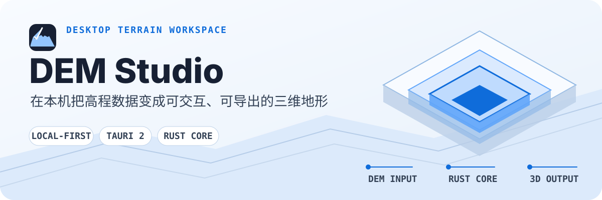
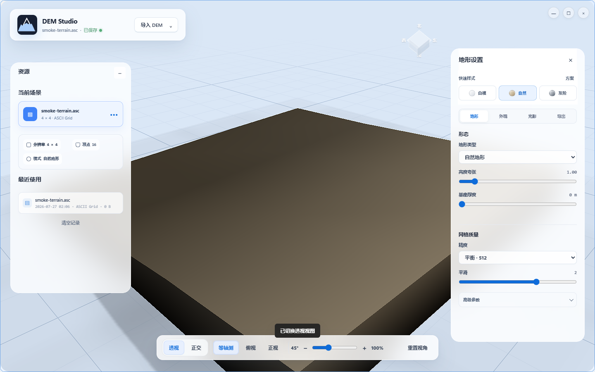

<p align="center">
  
</p>

<p align="center">
  <a href="README.md">中文</a> ·
  <a href="README_EN.md">English</a>
</p>

<p align="center">
  <a href="https://github.com/SpDDoggy/DemStudio/actions/workflows/desktop-ci.yml"></a>
  <a href="./LICENSE"></a>
  
  
</p>

DEM Studio 是一款本地优先的桌面地形可视化与 DEM 渲染工具。导入高程数据后，你可以在同一个工作区里浏览三维地形、调整相机与材质，并导出带地理参考的结果；文件处理、渲染和应用状态都保留在本机。

<p align="center">
  
</p>

<p align="center"><sub>Windows 11 实机运行时冒烟：ASC 样本经 Tauri 路径读取、Rust Core 解析并由 Three.js 完成地形重建。</sub></p>

## 从数据到地形

| 01 · 导入 | 02 · 塑形 | 03 · 导出 |
| --- | --- | --- |
| GeoTIFF/TIFF、SRTM HGT、ASC、PNG/JPG/WebP | 调节高度、相机、光照、材质、网格质量与后期效果 | PNG、PNG + World File、GeoTIFF、TIFF + World File |

坐标和地理配准信息可来自 PRJ、AUX.XML、TFW、TIFW、WLD 等侧车文件。应用设置、自定义预设和最近文件记录保存在本地，核心工作流不依赖 CDN 或云端服务。

## 为什么这样构建

DEM Studio 将计算、渲染和桌面能力分成三个清晰边界：

- **Rust DEM Core**：负责 ASC、HGT、GeoTIFF 解码，NoData 处理、统计、网格抽样、平滑与 GeoTIFF 编码。
- **Three.js / WebGL**：负责场景、材质、相机、实时交互和 GPU 渲染。
- **Tauri 2**：负责文件访问、系统对话框、设置存储、无边框窗口和跨平台打包。

这让高程语义可以脱离界面独立测试，同时保留现有 WebGL 渲染链的实时表现。完整边界见 [Rust Core 与 Fluent 桌面壳决策](docs/adr/0002-rust-dem-core-and-fluent-shell.md)。

## 本地运行

需要 Node.js 18+、Rust stable，以及当前系统对应的 [Tauri 2 系统依赖](https://v2.tauri.app/start/prerequisites/)。

```bash
git clone https://github.com/SpDDoggy/DemStudio.git
cd DemStudio
npm install
npm run verify
npm run desktop:dev
```

构建当前平台的桌面应用：

```bash
npm run desktop:build
```

Windows 可运行自动化宿主冒烟，检查应用启动、Tauri 桥接、ASC 导入和地形渲染：

```powershell
npm run verify:runtime:windows
```

## 平台与验证状态

| 平台 | 架构 | 目标产物 | 当前证据 |
| --- | --- | --- | --- |
| Windows | x64 | 独立 EXE、NSIS Setup | Release 构建、启动与 ASC 运行时冒烟已通过 |
| macOS | Apple Silicon | App、DMG | 工程与 CI 已配置；runner 与实机验证待完成 |
| macOS | Intel | App、DMG | 工程与 CI 已配置；runner 与实机验证待完成 |
| Linux | x64 | AppImage、Deb | 工程与 CI 已配置；WebKitGTK 环境与实机验证待完成 |

当前 CI 在没有签名证书时生成的是**无签名验证产物**，不是可正式分发的发行包。Windows 结果也不能替代 macOS 或 Linux 的平台验收；准确边界以[三端发布矩阵](docs/product/release-matrix.md)为准。

## 项目结构

```text
.
├─ index.html               # DEM Studio 前端与现有渲染逻辑
├─ src/host-bridge.js       # Web 前端与 Tauri / Rust Core 的桥接
├─ src-tauri/dem-core/      # 可独立测试的 Rust DEM 核心
├─ src-tauri/               # Tauri 宿主、权限与打包配置
├─ scripts/                 # 基线检查、运行时冒烟与状态迁移
├─ tests/fixtures/          # 可重复的测试样本
└─ docs/                    # 架构决策、迁移契约与发布证据
```

## 从 Lens 迁移数据

如果本机存在旧版 Lens DEM Studio 数据，可以显式传入源文件：

```bash
npm run migrate:lens -- "路径/到/db.json"
```

脚本只迁移设置、预设和最近文件，不修改源文件。迁移前请退出 DEM Studio，避免目标存储被运行中的应用覆盖。

## 当前边界与路线

尚待完成的关键验证包括真实 GeoTIFF/HGT/图像高度图回归、自动导出回归、大栅格性能与内存基准、安装升级回归，以及各平台签名和实机验收。

- 建立跨平台真实样本金样回归
- 拆分当前单文件前端，形成场景、设置和导出工作流模块
- 收紧内容安全策略与宿主权限
- 完成 Windows 签名、macOS 签名与公证及正式更新链路
- 在真实 macOS/Linux 环境完成运行时和导出验收

## 设计与工程依据

- [Windows 验证记录](docs/product/windows-validation.md)
- [三端发布矩阵](docs/product/release-matrix.md)
- [迁移契约](docs/product/migration-contract.md)
- [Tauri 三端架构决策](docs/adr/0001-tauri-cross-platform-host.md)
- [Rust Core 与 Fluent 桌面壳决策](docs/adr/0002-rust-dem-core-and-fluent-shell.md)
- [Fluent UI / Brand Spec](docs/design/brand-spec.md)

## 许可证

DEM Studio 使用 [MIT License](LICENSE)。
